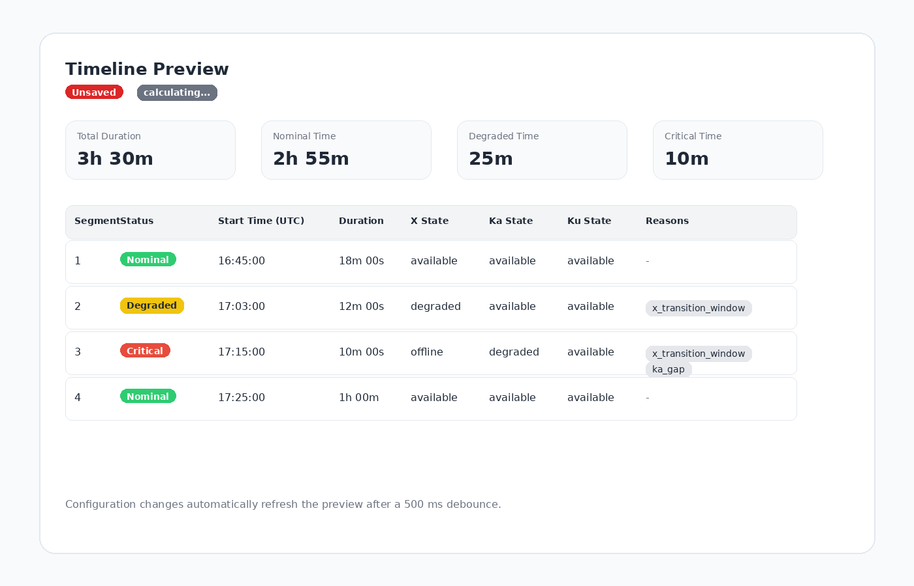
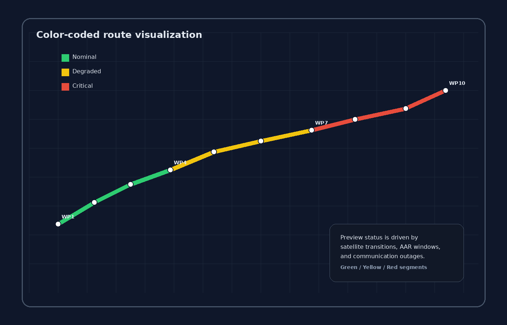

# Mission Communication Planning

Pre-flight communication degradation prediction for satellite transports.

## Mission Planning Features

### Mission Planning Interface

Create and manage missions with transport configurations.

**Features:**

- Define mission routes with waypoints
- Configure satellite transports (X-Band, Ka, Ku/StarShield)
- Set timing windows and operational constraints
  - All times use 24-hour format (HH:mm) for aviation/maritime consistency
  - Times are entered and displayed in UTC timezone
- Specify azimuth angle thresholds for degradation
- Mission timeline visualization
- Real-time timeline preview with automatic updates when configuration changes
- Unsaved-state indicator so you know when the preview is ahead of the saved leg
- Color-coded route overlay for nominal, degraded, and critical segments

**Transports Supported:**

- X-Band (primary command & control)
- Ka-Band (high-bandwidth data)
- Ku-Band/StarShield (Starlink connectivity)

**See:** [Mission Planning Guide](../missions/mission-planning-guide.md)

### Real-Time Timeline Preview

The preview recalculates automatically after a short debounce whenever you edit
satellite transitions, outages, AAR windows, or manual AR tracks. A manual AR
track is projected onto the planned route: its earliest and latest projected
points bound an X-Band degraded interval. The manual track remains an orange
dashed geographic overlay; it does not replace or redraw the planned route.
You can make a change, watch the route and status colors update, and only save
once the result looks sane.
The preview panel shows an Unsaved badge whenever the current configuration
differs from the persisted leg.

What the preview tells you:

- Green segments mean nominal communication coverage
- Yellow segments mean degraded communication
- Red segments mean critical communication gaps
- The timeline table lists segment status, UTC timing, duration, transport
  state, and reason codes
- Route map overlays update immediately so transition impacts are easy to spot
- The preview uses the same calculation engine as the saved leg, so what you see
  is the same model the API stores

How to use it well:

1. Make one configuration change at a time when you are trying to understand a
   color change.
2. Use the table to read the reason codes, then cross-check the map to see where
   the risk sits on the route.
3. Keep experimenting while the Unsaved badge is present; save only when the
   preview matches the mission intent.
4. For long routes, expect the table to stay usable by rendering only the visible
   rows.

### Satellite Geometry Engine

Analyzes 3D satellite positions and communication viability.

**Capabilities:**

- Real-time azimuth angle calculation
- Elevation constraint checking
- Multi-satellite tracking
- Degradation window prediction
- Communication status (nominal/degraded/lost)

**Output:**

- Timeline of degradation windows by flight phase
- Affected transports per window
- Duration and severity estimates
- Crew briefing summaries

### Multi-Format Exports

Generate mission briefing documents in multiple formats.

**Export Formats:**

- **PDF:** Crew briefing with charts and timelines
- **CSV:** Log format for post-flight analysis
- **XLSX:** Excel format with multiple sheets

**Contents:**

- Mission summary and timing
- Transport configuration
- Degradation window details
- Satellite geometry data
- Recommendations and notes

**APIs:**

- `POST /api/missions/{id}/export/pdf`
- `POST /api/missions/{id}/export/csv`
- `POST /api/missions/{id}/export/xlsx`

**See:** [Mission Communication SOP](../missions/mission-comm-sop.md)

### Grafana Mission Visualization

Real-time mission timeline and alert integration.

**Features:**

- Mission timeline panel
- Degradation window overlays
- Satellite coverage indicators
- Alert rules for approaching windows
- Transport status gauges

**Dashboards:**

- Mission Overview (timeline and status)
- Transport Status (per-transport details)
- Satellite Geometry (azimuth/elevation charts)

**See:**
[Monitoring Setup - Mission](../../monitoring/README.md#mission-communication-planning)
