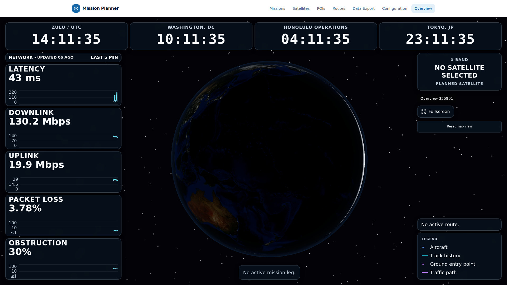
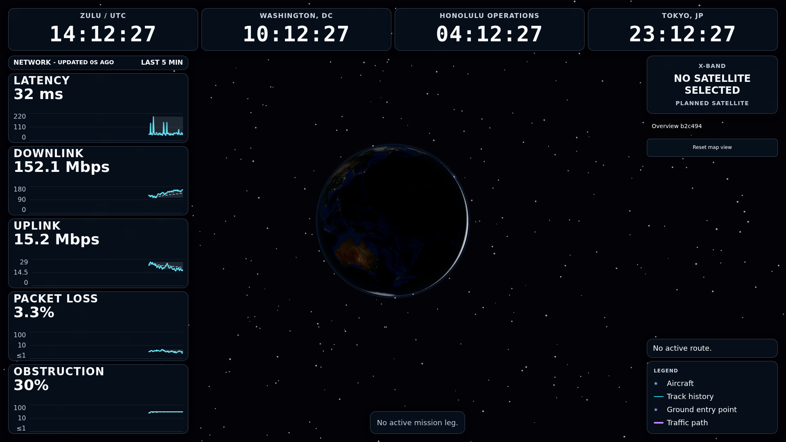
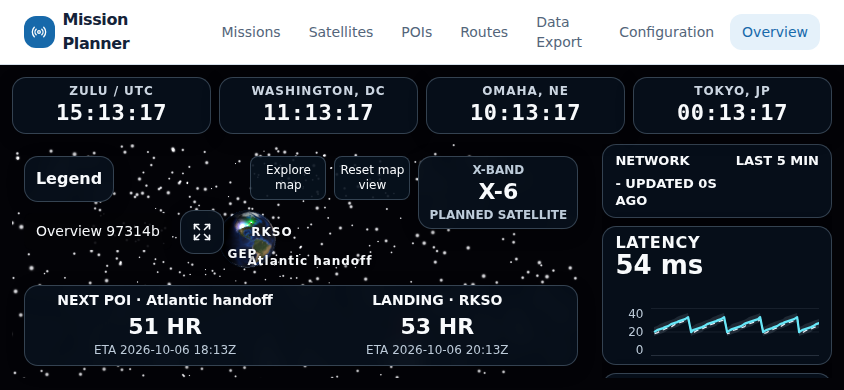

# Overview window synchronization acceptance

Date: 2026-10-04. Issue: #257. **Task 5 steps 1–6 are complete.** The
continuation below resolves the required browser regression gate. Independent
whole-branch review, required exact-head CI, feature PR and merge remain pending.
Tasks 1–4 and their recorded contracts/rulings remain delivered.

## Candidate and evidence

Starting SHA: `010a20908c42c7318ccc6becab00a59214746faf`. Published feature
branch: `feat/257-overview-window-sync`, worktree `/tmp/starlink-257`. Merged
current `origin/dev` `b2ea3341f78137c1409a618c8d8da5814a14dac2` without
rewriting history; merge commit `53cb650be584c98613db6a308586ebc0e0c3edaf`.

Production input candidate: `1d191692e8979bbc2d87da53ca470e7a91ed387b`. The
final delivery SHA and fresh checks are recorded in the environment-local
continuation handoff to avoid a self-referential commit. The bounded
[summary](evidence/2026-10-04-overview-window-sync/summary.json) and screenshots
below preserve selected observations in Git. Full logs, request records, videos
and failure traces are environment-local under:

```text
.superpowers/sdd/2026-10-04-overview-window-sync-acceptance/evidence/task5/
```

This report distinguishes real production requests from controlled REST
fixtures. Neither lane establishes physical dish, real provider or
suspended-device acceptance. The original checkout and previous evidence were
preserved.

## Real production path

The production-only Playwright config requires a loopback HTTP origin and has no
preview server, one Chromium worker and no retries. The ordinary config excludes
this journey. The runner refuses dirty tracked files, occupied task ports and
existing task resources, archives exact tracked HEAD, and builds the production
frontend/backend Dockerfiles. Local dependencies and untracked artifacts cannot
become Docker build inputs.

Standalone Compose project `starlink-257` uses Nginx, the real backend,
Prometheus production config/rules, and eight task-specific named volumes.
Backend binds `127.0.0.1:18257`; Nginx binds `127.0.0.1:15257`. No dish,
Grafana, global container names or shared data mounts are required. Simulation
begins at 35/-100 with GEP 36/-102 using supported environment variables. The
default simulation crossed the dateline and emitted invalid longitude
180.24228229034392; the existing projection correctly paused follow. Default
simulation dateline behavior remains outside this acceptance; product validation
was preserved.

The two-page journey uses actual Configuration and Missions forms, successful
PUT/control responses through Nginx, and real V2 mission/leg/route storage. The
derived second KML uses KCCC/KDDD, +2 latitude/+10 longitude and unchanged
timestamps. Route expectations come from real route detail and rendered React
props, using existing `ROUTE_OVERLAY_RADIUS` and eight segments.

Coverage includes saved clock label/timezone/time text, both link toggles,
history selection and returned bundle, browser-local follow preference, mission
activation/switch/deactivation, active-leg timing changes, generated POIs and
arrival state. Configuration remains focused during timed observations. Unsaved
independent drafts, manual camera pose, Canvas/uPlot identity, retained history,
native fullscreen truth and the post-startup navigation baseline are checked.
Deactivation compares exactly four restored clock labels to the real successful
settings response.

Result: **2 passed (1.9 minutes)** at the production input candidate above. All
mutation responses were 200 through Nginx. Every recorded response-to-visible
observation was within 8000 ms. The X-band absence assertion begins without a
seeded planned satellite link; its real saved API state is verified, while
visible enabled-to-disabled projection requires the controlled fixture lane.

| Observation             | Ordinary (ms) | Native fullscreen (ms) |
| ----------------------- | ------------- | ---------------------- |
| clock                   | 3094          | 4044                   |
| starshield_link_enabled | 4072          | 3973                   |
| x_band_link_enabled     | 29            | 32                     |
| history-window          | 5128          | 5312                   |
| browser-follow          | 153           | 73                     |
| activate-0              | 4037          | 4105                   |
| activate-1              | 4009          | 4025                   |
| active-leg-timing       | 3965          | 4159                   |
| deactivation            | 5049          | 5160                   |

Desktop and native fullscreen screenshots use an explicit 1920×1080 viewport:





## Controlled saved-state and display controls

Controlled fixtures separately cover failed PUT, interrupted/held GET, recovery,
old history-window delivery, obsolete route identity, multiple/closed displays,
targeted recenter, native remote fullscreen rejection and local entry/exit. GPS
coordinates unavailable/recovered are fixture projections: the real simulation
API explicitly rejects dish GPS mutation, so hardware control is unaccepted. The
fixture defaults retain the previous valid position.

At the clock-fix candidate, supplemental refresh/control/clock/path checks
passed **11 tests**, with the reset regression separately failing. The four
refresh cases include failed save/interrupted GET/history mismatch recovery;
four display-control cases cover targeted displays, rejected native entry, local
entry/exit and blocked popup feedback. Expanded link/GPS projection checks then
passed **two tests (40.6s)**, starting with both paths visible. Ordinary
Starshield/X-band convergence: 4560/5357ms; native: 2315/4827ms. GPS
loss/recovery: ordinary218/1342ms; native852/831ms. All ≤8000ms. Evidence:
`supplemental.log`, `paths-complete.log` and JSON artifacts.

Native fullscreen observation uses CDP `userGesture: false`; no browser
fullscreen permission flags are added. The optional headed Xvfb/XTest run sends
OS Escape rather than treating Playwright synthetic Escape as browser native
exit. The device/browser and physical display limitations remain.

## Earlier quality gates and regression diagnosis

- `./tools/verify frontend`: **90 files / 788 tests passed**, production build
  passed after the clock fix; existing large-chunk advisory retained.
- `./tools/verify backend`: **1422 passed / 20 skipped**, two existing Cartopy
  warnings.
- `./tools/verify static`: passed in the tracked uv development requirements
  environment. The first system-Python invocation lacked pytest; dependencies
  and tooling were preserved rather than changing the gate.
- Isolation/config tests: **10 passed**. Runner tests: **4 passed**, including
  real Git/socket rejection and preservation of build metadata when Playwright
  clears its browser output directory.
- Required eight-file existing browser command: **47 passed / 6 failed** (12.3
  minutes), `regressions.log` and `regressions/*/trace.zip`.

All six failures are in `overview-map-interaction.spec.ts`. Original
expectations, retry count and tolerances were preserved:

| Case                            | Feature lane                  | Unchanged dev comparison                     |
| ------------------------------- | ----------------------------- | -------------------------------------------- |
| Scroll at width 844, line 20    | scrollTop remains 0           | Same scroll failure                          |
| Landscape rail, line 166        | scrollTop remains 0           | Fails earlier: stacked rather than landscape |
| Rotation DPR 1.5, line 206      | stacked rather than landscape | Same layout failure                          |
| Rotation DPR 2, line 206        | stacked rather than landscape | Same layout failure                          |
| Interrupted pointers, line 261  | reentry camera unchanged      | Fails earlier: stacked rather than landscape |
| Eased automatic reset, line 429 | one distinct sampled pose     | Isolated base passed                         |

Base comparison is a tracked archive of unchanged
`b2ea3341f78137c1409a618c8d8da5814a14dac2`, with its unchanged tests and current
installed dependencies from that same lockfile. Evidence: `base-scroll.log` (2
failed), `base-rotation.log` (4 failed, including DPR 1), `base-reset.log` (1
passed), and corresponding trace directories. These comparisons identify
baseline/environment dependence but do not turn the required regression failures
into passes. Unmatched causes remain unresolved. Vite preview also logs refused
proxy requests for endpoints not intercepted by existing fixtures; those
diagnostics are preserved.

Feature reset was reproduced in the supplemental lane and a diagnostic copy. The
diagnostic hit target was the empty `overview-display-controls` container, and
camera coordinates before/after drag were identical. New controls increased the
overlay area and blocked the old drag location. The outer overlay and display
container now pass empty-area pointers through; fullscreen buttons and
map/satellite cards remain interactive. Original regression
coordinates/expectations are retained. Both tests now pass (**two passed,
1.3m**), `pointer-fixed.log`. The initial wrapper-only fix failed both tests;
preserved traces identified the outer container too. At that stage, four baseline-dependent
layout/scroll cases remained unresolved until the fresh full lane succeeded. All
four display-control cases then passed headed in isolated Xvfb, including actual
OS Escape and native state propagation: **4 passed (2.3m)**,
`native-os-final.log`. No fullscreen permission flags were used.

## Acceptance-discovered fixes and rulings

Real short routes resolve both ends to Erick, OK. Clock keys based on
label/timezone collided and retained a stale fifth DOM clock after deactivation.
Fixed four-slot identity uses the slot ordinal; no API/schema change. Regression
RED: expected four, received five (1 failed / 1 passed); GREEN: 2 passed. The
production oracle now verifies the exact restored count and labels. A future
dynamic list would require stable slot IDs. The first unsupported jest-dom
assertion was corrected before GREEN, and the full frontend gate reran.

Earlier production attempts remain preserved: first (two failures) exposed
immediate server-controlled switch assertions and cross-case saved state; second
(two failures) exposed invalid simulation coordinates. Tests now use successful
responses, trusted clicks, real API reset per case, and valid simulation
preconditions. The third candidate passed two journeys but its screenshots
exposed the duplicate clock and a device viewport override. It is superseded by
the stronger clock-fix run. Playwright cleared first-run metadata because it
shared the output root; no full provenance claim is made for that run. Browser
artifacts now occupy a child directory, verified RED→GREEN.

Preserve previous rulings: scoped mutation cancellation/serialization, confirmed
cache plus existing clock-unavailable error UI, command partitions and
deadlines, post-startup navigation baseline plus mount identities, projection
constants, and command-scoped Codex commit identity. An issued native fullscreen
request cannot be canceled by a message deadline.

## Runtime, cleanup and continuation

Local runtime: Node 22.22.2, npm 10.9.7, Playwright 1.63.0, Chromium
153.0.8010.12. Production build: Node 22.23.3/npm 10.9.9; Nginx 1.31.6, Python
3.11.17, Prometheus 3.5.0. Docker daemon 29.8.1, overlayfs, inherited
`DOCKER_HOST=unix:///run/user/1002/docker.sock`, context `default`. Proxy, CA
trust, credentials and active Docker configuration were preserved. Cloud status
capability/policy snapshot were unavailable; readiness claims are limited to
observed commands. Image IDs and resolved base-image digests are in
per-candidate build/image evidence.

The runner stops only its owned `starlink-257` project and named volumes, checks
project labels and binds both task ports after cleanup. Task source archives are
removed; full evidence and shared resources remain.

The continuation below completes **Task5 steps1–6**. Next is separate fresh
whole-branch review, followed by authorized protected PR/merge into `dev`; no
force push, deploy, main promotion or shared deletion.

## Task 5 continuation: resolved compact layout and final evidence

Continuation started at `b9df60295fa602d0eb3c2d4660e965f83bc7f33b`, whose final
required lane was 51 passed/two scroll failures; all rotation/pointer/reset cases
had passed. This supersedes the historical six-failure lane above without losing
its evidence. Remote dev remains `b2ea3341f78137c1409a618c8d8da5814a14dac2`.

Both original scroll cases reproduced. The upper controls occupied 170.17px and
arrival 80.69px in a bounded 844×325 shell, forcing stacked layout. The page then
scrolled 140px while the metrics rail stayed 0. Landscape-only CSS places map
controls beside legend, identity/fullscreen on one row, and satellite across both
rows. Original fit/flow guards, readable sizes, gesture logic, tests and
thresholds remain unchanged. Cost if this ruling is wrong: compact long-content,
follow and native behavior need further review.

Original regressions RED: two failed → GREEN: two passed (58.5s). Separate browser
bounds verification passed (one test, 18.7s): controls/arrival contained, text fit,
no overlapping panels. Its screenshot was visually inspected:



Required unchanged eight-file lane: **53 passed (12.0m)**. Canonical frontend:
**90 files/788 tests plus production build passed**; backend: **1422 passed/20 skipped**,
two existing Cartopy warnings, 118.97s; static passed. Sequential runner safety:
**four passed (0.23s)**. Existing chunk advisory and preview proxy diagnostics
are preserved, with no retry/tolerance/dependency changes.

Real production input: `bf675690f2e0fbecbcc394a1140372ccf8609c24`, exact tracked
archive/rebuilt images. **Two passed (1.8m)**; ordinary/native fullscreen=false/true,
all 18 mutations 200 through Nginx, largest propagation 5531ms. Navigation 2→2,
Canvas/uPlot identity, camera intent, retained history and four restored clocks
pass. [Bounded continuation evidence](evidence/2026-10-04-overview-window-sync/continuation.json)
preserves the real timings/read counts and mutation summaries. Prior controlled
controls/GPS/link/race evidence and all documented limitations remain unchanged.

Full continuation artifacts are environment-local:

```text
.superpowers/sdd/2026-10-04-overview-window-sync-acceptance/evidence/task5-resume/
```

The final report/checklist commit changes docs/evidence only. Fresh results at
its frozen SHA are saved outside Git as `final-summary.json`, `review-handoff.txt`
and `final-manifest.json`, with canonical/browser/production logs. Cleanup
checks only task project/volumes and ports; unrelated resources are preserved.
Step 7 independent review and PR/merge remain pending; this author's validation
is not the separate fresh whole-branch review.
