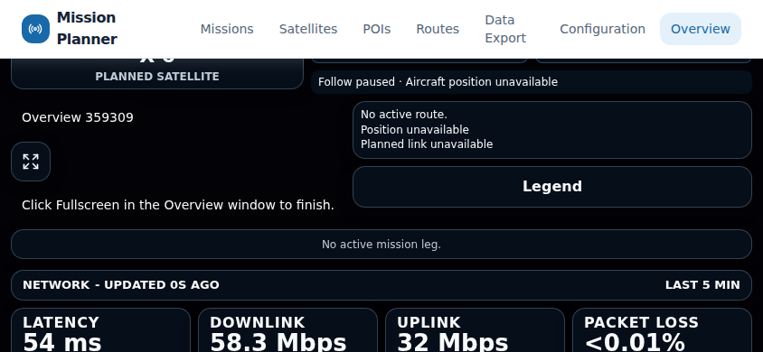

# Issue 257 independent follow up review

Date: 2026-10-04. Reviewed exact source:
`77afa602c1306e1106bfcdbda50f2ff3a5bb7721`.
Worktree `/tmp/starlink-257`, branch `feat/257-overview-window-sync`.
Fix range: `b6f6d1ab16719db43eb79c030d99d630fd430045..77afa602`.
Whole-branch range/current remote dev:
`b2ea3341f78137c1409a618c8d8da5814a14dac2..77afa602`.

**R1 and R2 are independently closed.** No Critical or Important finding
remains. New R3 is Minor and requires a documentation correction in integration.
The fresh review is complete; Task 5 step 7 remains unchecked for that gap.
Product technical readiness does not establish PR or merge readiness.

Authority: [approved design](../specs/2026-10-04-overview-window-sync-design.md),
[main plan](2026-10-04-overview-window-sync.md),
[session protocol](2026-10-04-overview-window-sync-handoff.md), all linked task
and progress records, [original review](2026-10-04-overview-window-sync-review.md),
[correction record](2026-10-04-overview-window-sync-integration.md) and
[acceptance report](../../reports/2026-10-04-overview-window-sync-acceptance.md).
The complete original and follow-up integration handoffs were read.

## Independence and scope

Reviewer `fresh_followup_review` received a fresh context containing the exact
ranges, authority and evidence paths. It reviewed the full dev diff in passes
and independently ran focused unit/browser verification. It changed no source,
tracked documentation, index, HEAD or branch. Its tests and rebuild write only
new evidence. The coordinator verified remote heads, no feature PR, clean
checkouts and evidence integrity before recording this review.

Both worktrees and every prior contract, ruling, failure trace and evidence
artifact are preserved. This session records findings/progress only; no
implementation fix, PR creation or merge occurs.

## R1 and R2 closure

R1 Important: the complete stable display/right containers now participate in
observation and fit decisions. Wrapping preserves readable identity and feedback;
oversized compact feedback uses the established stacked scrolling flow. The fix
does not change polling, channel, camera, charts or native fullscreen logic.
Original fit guards, sizes, one-pixel bounds budget and pointer passthrough remain.

Independent reproduction at 844×390 with paused follow, unavailable fixture GPS
and real native rejection passed. Paused remains landscape/flow=false; rejection
becomes stacked/flow=true. Display bottom is 725.78px; arrival begins at 733.78px.
Containment, nonoverlap, text bounds and matching identity pass, as do trusted
local native entry/exit and actual controller state. The guidance screenshot was
visually inspected after scrolling it into view.

The reviewer also triggered real child-owned local rejection with an untrusted
click through CDP `userGesture:false`, without host feedback/content-key changes.
Its settled probe checks 844×390 → 1920×1080 → 390×844 → 844×390, explicitly waits
for the expected layout, and checks controls AND arrival containment, text and
identity. It passed. The first controls-only probe could capture a pre-resize
frame; its source/results are retained but superseded for portrait acceptance.
The stable-container ruling is supported by both remote and local feedback.

R2 Minor: investigation status records delivered Tasks 1–4/Task 5 steps 1–6,
the historical final 53-test pass and remaining delivery gates. Original diagnosis
is explicitly historical; later design approval is recorded alongside the former
draft observation. Original reproduction is retained.



## R3 remaining finding

Severity: **Minor**. File/line: `docs/features/overview.md:154`; related
`frontend/mission-planner/src/hooks/api/useOverviewHistory.ts:19`.

The guide says hidden tabs pause interval polling, while history now enables
`refetchIntervalInBackground: true`. Chart motion and fetching have separate
ownership. Operator effect: incorrect expectations about history freshness and
background requests, contradicting the delivered synchronization guidance.

Reproduction: compare that sentence with the hook and the independently passing
unit case that refreshes the history bundle after five seconds without focus.
Requested correction: describe configured background history polling while
mounted, distinguish hidden-tab chart-motion pauses, and retain browser scheduling
and suspended-device catch-up limits. No polling change is requested. Integration
must make and verify this prose correction; it is not waived by this review.

## All five review focus areas

1. **Unfocused settings, camera and drafts:** scoped live observers preserve
   Configuration defaults and camera ownership. Independent ordinary/native
   browser saves verified label/timezone time, foreground editing, unsaved draft,
   manual camera, Canvas/uPlot identity, retained history and navigation baseline.
   Mission activation/switch/deactivation also preserved radius/eight segments.
2. **Save races and history interpretation:** cancellation, queued scoped saves,
   late resolution/rejection, full confirmed responses and failed drafts passed
   real QueryClient tests. Browser failed PUT/interrupted GET recovery and delayed
   old-window history/failed-window rollback passed without mislabeling samples.
3. **Targeting, disappearance, expiry and duplicates:** parser/session/card tests
   cover closed schemas, wrong targets/results/actions, stale sequences, current
   capabilities, deadlines, FIFO-128 duplicates and late callbacks. Two-display
   recenter affected only the chosen display; loss required explicit reselection.
4. **Actual native fullscreen:** helper/host/session tests cover root entry,
   fulfillment without entry, timeout and late completion. Real rejection,
   trusted local entry, already-fullscreen feedback and XTest OS Escape passed
   with truthful controller state/focus. No permission flags were used.
5. **Recovery and resource ownership:** interrupted reads, shared observers,
   no overlapping reads, AbortSignal unmount, StrictMode, timers/listeners/channel
   failures and popup cleanup passed. Layout growth without frame/content-key
   changes triggers measurement and observers disconnect on unmount.

## Independent verification and evidence

Fresh focused units: **12 files/177 tests passed** (1.70s). Independent browser
lanes: compact **1 passed** (10.4s), headed refresh/control including OS Escape
**8 passed** (3.9m), settled local-feedback probe **1 passed** (10.5s). Maximum
controlled propagation was 5019ms against the unchanged 8000ms ceiling.

Fresh exact-source Vite rebuild passed (7.64s); all ten files matched the served
production assets by SHA256. The coordinator read successful logs and inspected
the compact screenshot. [Portable bounded evidence](../../reports/evidence/2026-10-04-overview-window-sync/follow-up-review.json)
records findings, test results, provenance and measurements.

Full environment-local commands, source/config, logs, bounds, screenshots and
53-artifact reviewer manifest remain at:

```text
.superpowers/sdd/2026-10-04-overview-window-sync-acceptance/evidence/follow-up-review/
  reviewer-20261004-fresh/review-verdict.md
  reviewer-20261004-fresh/summary.json
  reviewer-20261004-fresh/review-manifest.json
  coordinator-evidence-audit.json
```

Canonical suites were audited, not rerun in review. All 212 final integration
artifacts and 100 prior final acceptance artifacts matched hashes/sizes; product
trees and candidate input hashes matched 77afa602. Recorded source acceptance:
frontend 90 files/789 tests/build; backend 1422 passed/20 skipped/two warnings;
static passed; browser 58 passed; native Escape one passed; real production two
passed/all 18 mutations 200/maximum 5726ms; runner four passed.

Runtime remains Node22.22.2/npm10.9.7, carried runtime PATH, Chromium153.0.8010.12.
Actor Docker29.8.1/overlayfs uses `unix:///run/user/1002/docker.sock`, default
context. Proxy/CA/credentials are preserved. Cloud status capability/policy
snapshot are unavailable; no broader readiness is inferred. Sandbox preview/
network restrictions required authorized escalation; no approval rejection.
No task containers/volumes remain; all four task ports were available after tests.

## Behaviors considered but declined to judge

The coordinator accepts each reviewer limitation below for the stated reason,
preserving the approved contracts and explicit acceptance gaps:

- Physical dish/provider/real GPS mutation: simulation/fixtures cannot establish
  hardware acceptance.
- Fully suspended-device wall-clock bounds: the contract promises resumption
  catch-up; scheduled browser timers cannot guarantee the healthy eight-second bound.
- Default dateline simulation: preserved explicit unaccepted precondition; task
  simulation remains 35/-100 with GEP36/-102, with coordinate validation unchanged.
- Real X-band visible transition without a seeded link: real persisted API state
  and controlled visible projection remain distinct evidence.
- Other browsers/physical multi-monitor native windows: Chromium/Xvfb does not
  establish those configurations.
- Aborting an issued native fullscreen request: no API exists; expiry truth and
  actual state were reviewed under the approved ruling.
- Atomic cross-endpoint snapshots: approved REST behavior is eventual convergence.
- Future dynamic clock-list identity: current contract fixes four editable slots.
- Rewriting historical approval/baseline records beyond R2: preserve the original
  authority/evidence; linked current progress records supply delivery status.

## Exact candidate integration continuation

Next: integration corrects R3, verifies documentation and records its closure;
then closes Task 5 step 7 and freezes the final candidate before applicable
canonical/browser/production acceptance and exact-head protected PR checks.
Do not repeat Tasks 1–4 or approvals. New documentation commits change HEAD;
77afa602 results are source evidence, not acceptance/CI at a later head.
Material product changes require another fresh independent follow-up review.

Verify current dev/feature heads and reconcile dev advancement without rewriting
published history. Preserve worktrees and all evidence. Inherited authorization
covers normal feature commits/push and PR/normal merge to dev after acceptance,
fresh review, protection, mergeability and exact-head CI pass. No force push,
protection bypass, deployment, main promotion or shared cleanup.

The documentation commit's exact SHA and complete ready-to-paste continuation
are saved outside Git at `evidence/follow-up-review/integration-handoff.txt`
under the acceptance workspace above. Missing full local artifacts elsewhere
remain an evidence gap.
