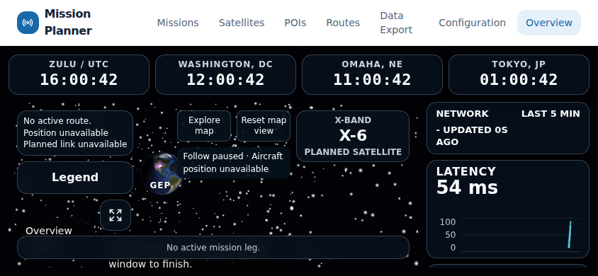

# Issue 257 independent whole-branch review

Date: 2026-10-04. Assigned stage: acceptance Task 5 step 7, review only.
Reviewed HEAD: `2cf4da323956ebfd061974d7f07eca9dd275329a`.
Base/current remote dev: `b2ea3341f78137c1409a618c8d8da5814a14dac2`.
Worktree `/tmp/starlink-257`, branch `feat/257-overview-window-sync`.
No feature PR exists. Original checkout and all prior evidence are preserved.

Authority: [design](../specs/2026-10-04-overview-window-sync-design.md),
[main plan](2026-10-04-overview-window-sync.md),
[handoff protocol](2026-10-04-overview-window-sync-handoff.md), all linked
progress/task plans and [acceptance report](../../reports/2026-10-04-overview-window-sync-acceptance.md).

## Scope and assessment

Fresh reviewer `whole_branch_review` received a clean context, the exact Git
range and the complete authority/evidence paths. It reviewed the whole branch
in passes, including query lifecycle, confirmed-save races, message validation,
targeting/expiry, actual native state, UI, acceptance tooling, tests and guidance.
The coordinator audited evidence and performed a targeted compact browser probe.
This is separate from the implementation author's self-check.

**Original review complete; not ready to merge.** R1 was Important and open
at this review. [Integration corrections](2026-10-04-overview-window-sync-integration.md)
now address R1/R2; [fresh follow-up review](2026-10-04-overview-window-sync-follow-up-review.md)
independently closed both at 77afa602. R3 Minor documentation remains open.
No Critical/Important finding remains; step 7 stays unchecked pending R3 closure.
The findings below preserve the original review and reproduction.
This session changes review records and bounded evidence only, with no product
fix, PR creation, merge, deployment or cleanup of shared resources.

The branch keeps REST saved-state authority, scoped five-second polling,
serialized/cancelled settings reads and full confirmed responses. Tests exercise
draft retention, history-window mismatch, channel partition/targets/deadlines,
StrictMode cleanup and native rejection/local entry/exit. Production evidence
distinguishes real Nginx responses from controlled fixtures and hardware limits.

## Findings

### R1 — Important: compact fullscreen fallback obscures arrival and display identity

Primary changed location: `frontend/mission-planner/src/pages/OverviewOverlayLayout.css:533`.
Related: `src/pages/OverviewPage.css:175`, `OverviewPage.css:194`,
`OverviewPage.tsx:704`, and `useOverviewLayout.ts:235`, relative to that frontend.

The landscape display wrapper becomes a nonwrapping flex row. Rejection adds a
multiline feedback paragraph and compresses the identity. The layout observer
does not observe the display wrapper/feedback; its content key and panel fit
checks omit them. The added area can overflow while layout stays landscape.

Operator effect: the expected local-click fallback and matching display suffix
are obscured by the arrival panel. The arrival panel also competes with this
text. This occurs in the portable workflow where remote entry is rejected.

Reproduction at the reviewed SHA, Chromium 153.0.8010.12, 844×390:

1. Install the existing controlled window fixture; open Overview and
   Configuration in one browser context.
2. Enable Follow aircraft in Configuration and make fixture GPS unavailable.
   Follow-paused feedback alone remains contained.
3. Wait for Overview activation to expire using CDP `userGesture: false`;
   keep Configuration foreground and click its Fullscreen command.
4. Confirm actual native state remains windowed and the rejection guidance
   appears. Observe the arrival panel obscuring that guidance/identity.

Measured rejection state: landscape, flow false. Map stage bottom 378px;
feedback spans y334.17–392.17; arrival spans y333.20–366.00. Their rectangles
overlap by 31.83px and feedback exceeds the stage by 14.17px. Identity spans
y308.17–366.17 and its suffix is hidden. A geometry assertion fails after actual
local native entry, controller Fullscreen active, native exit and Windowed
reporting all succeed. No fullscreen permission flags were used.

Requested correction: include the complete dynamic display area in layout
observation/fit decisions and keep identity readable. Allow measured fallback
or wrapping when feedback needs more space. Add a compact rejection regression
with follow-paused text that checks containment, nonoverlap, identity and local
native entry/exit. Preserve original fit guards, readable sizes, pointer
passthrough, geometry, command deadlines and existing assertion tolerances.

Portable [bounds evidence](../../reports/evidence/2026-10-04-overview-window-sync/review.json)
and screenshot:



### R2 — Minor: investigation advertises superseded acceptance and draft status

Location: `docs/reports/2026-10-04-overview-window-sync-investigation.md:8`
and line 87. The current status attributes incomplete acceptance to failing
browser regressions, although the required final lane now passed 53 tests.
The final sentence still calls the approved design a draft for user review.

Operator effect: readers following issue documentation can mistake resolved
regressions or approved design for outstanding work. Reproduce by reading its
status beside the continuation/final acceptance record.

Requested correction: update current status to completed steps 1–6 and the
remaining review/integration gap, and label the original draft statement as
historical or replace its current-tense claim. Preserve the diagnosis/history.

## Verification and evidence limits

Fresh focused reviewer unit verification: **10 files / 160 tests passed**.
The command/log are preserved in local `evidence/review/focused-unit.log`.
Focused suites cover refresh, clock/history mutation races, parser/session,
host/controller hooks, settings card, shared helper and local fullscreen.

```sh
npm run test:unit -- \
  src/hooks/api/useOverviewRefresh.test.tsx \
  src/hooks/api/useUpdateOverviewClockSettings.test.ts \
  src/hooks/api/useUpdateOverviewHistorySettings.test.ts \
  src/services/overview-display-protocol.test.ts \
  src/services/overview-display-session.test.ts \
  src/hooks/useOverviewDisplayHost.test.tsx \
  src/hooks/useOverviewDisplayController.test.tsx \
  src/pages/OverviewDisplaySettingsCard.test.tsx \
  src/pages/OverviewFullscreenControl.test.tsx \
  src/pages/overview-fullscreen.test.ts
```

Fresh compact probe: visibility/native workflow **1 passed (12.8s)**; adding
the nonoverlap geometry assertion **1 failed** (R1). Both runs, JSON, screenshots,
trace, probe source and isolated Playwright config remain under:

```text
.superpowers/sdd/2026-10-04-overview-window-sync-acceptance/evidence/review/
```

Commands run from the frontend with the carried Node PATH:

```sh
npx playwright test --config /tmp/starlink-257/.superpowers/sdd/2026-10-04-overview-window-sync-acceptance/evidence/review/playwright.config.ts --output /tmp/starlink-257/.superpowers/sdd/2026-10-04-overview-window-sync-acceptance/evidence/review/compact-bounds-results
```

All 100 final acceptance artifacts matched the manifest hashes and sizes.
Saved results at reviewed HEAD: frontend 90 files/788 tests/build; backend
1422 passed/20 skipped; static passed; required browser lane 53 passed;
real production two passed, all 18 mutations 200, maximum latency 5647ms;
runner four passed. These are audited prior acceptance results, not reruns in
this review session. Source tree hashes match the final summary.

Fresh remote checks found exact feature HEAD, unchanged dev and no PR. Fresh
cleanup found no task containers, volumes or listeners on 18257/15257/5278/5280.
Docker configuration remained default context, actor socket
`unix:///run/user/1002/docker.sock`, daemon 29.8.1/overlayfs. Proxy/CA/credentials
were preserved; cloud status/policy snapshot remain unavailable.

Declined to judge: physical dish/provider/GPS mutation, fully suspended-device
wall-clock guarantees, default dateline simulator behavior and real X-band
enabled-to-disabled projection without a seeded link. These are explicit prior
acceptance limits, not silently accepted behavior. Controlled GPS/link and
Xvfb/XTest native Escape evidence remain distinct from physical acceptance.
Other browsers and physical display/native-window configurations remain
unaccepted by Chromium evidence. Aborting an already-issued native fullscreen
request is outside the browser API; timeout truth and actual state were reviewed
under the approved ruling.

## Integration handoff contract

Next stage: integration fixes for R1/R2, then fresh follow-up independent review
and final candidate checks before PR/merge into dev. Preserve all contracts,
rulings, evidence and both worktrees. Do not infer narrow feedback correctness
from desktop production results. Do not close Step 7 from earlier green lanes.

The exact delivered documentation SHA and ready-to-paste integration message
are in local `evidence/review/integration-handoff.txt`, avoiding a
self-referential tracked SHA. New commits require fresh exact-head required
checks and corresponding acceptance/review verification. Reconcile any dev
advance without rewriting published history. Inherited PR/fix/normal dev merge
authorization remains subject to acceptance, fresh review, branch protection
and exact-head CI. No force push, protection bypass, deploy or main promotion.
