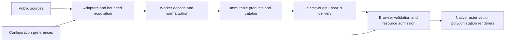

# Aviation weather architecture design

Draft for [issue 290](https://github.com/bcl1713/starlink-dashboard/issues/290).
Provide worldwide long-range aviation situational awareness through local
normalization and native globe rendering. Keep source formats and projections
behind the backend boundary, distinguish observations from forecasts and model
output, and preserve the completed radar behavior. This proposal needs design
review and the three local-render proofs below before implementation phases are
dispatched. It does not close the parent issue.

## Scope and architecture choice

Use public/open data where practical with no recurring paid API commitment.
Configuration owns layer, forecast-time and altitude preferences; Overview shows
passive weather context. Weather failures must leave telemetry, routes,
aircraft, ADS-B, POIs and globe interaction usable. Automatic route replanning
and certified flight-planning claims are outside scope.

Three approaches were considered:

| Approach                                                    | Benefit                                                                               | Cost                                                                           | Decision                                                    |
| ----------------------------------------------------------- | ------------------------------------------------------------------------------------- | ------------------------------------------------------------------------------ | ----------------------------------------------------------- |
| Separate bounded ingest worker and immutable local products | Decoding cannot block FastAPI; common renderer contracts; enforceable process budgets | Worker packaging and publication ownership                                     | Recommended                                                 |
| Decode scientific sources inside FastAPI on demand          | Fewer deployable components                                                           | Burst decoding competes with telemetry; cancellation and RAM harder to isolate | Suitable only for lightweight bulletin parsing              |
| Third-party rendered maps                                   | Less local processing                                                                 | Provider-specific presentation, reuse restrictions and possible recurring cost | Keep existing radar adapter; avoid as the system foundation |

Adapters acquire allowlisted source objects and preserve authoritative identity.
Normalizers decode GRIB2, NetCDF, HDF5 or bulletin formats, validate dimensions
and masks, reproject, and publish compact products. A single worker owns ingest,
locks and retention; FastAPI serves only complete published artifacts. Browser
renderers depend on product representation, units and identity, never source
URLs, GRIB parameter numbers or satellite navigation metadata.

Write a candidate directory, validate payload lengths and hashes, then
atomically replace the catalog pointer. A crash leaves the previous generation
usable until its original expiry. Readers lease published objects; retention
removes unleased expired generations. Reserve disk before download and delete
failed candidates. There is no decode in a dashboard request handler.

## Existing radar boundary

`app/services/overview_weather/rainviewer.py` already normalizes source,
product, schema, coverage encoding and capability into a stable `product_id`.
`acquisitions.py`, `admission.py` and `service.py` own shared leases, quotas and
eligibility. `app/models/overview_weather.py` and the frontend
`src/services/overview-weather.ts` validate the current manifest.

Keep `/api/overview-weather`, its settings file and existing Zod contract
unchanged during the design increment. Future integration exposes a compatible
radar entry in an additive `/api/aviation-weather/v1/catalog`; it wraps the
current manifest rather than changing its keys or recreating provider traffic.
Its payload representation remains `xyz-rgba-pair-v1`. The existing `product_id`
remains a capability identity; the new instance identity also includes
observation and coverage generation. Do not reinterpret the current
absence-alpha mask as a general scientific validity mask.

Preserve radar opacity 0.40, independent hatching 0.17, atomic coarse/detail
replacement, 20-minute current and 60-minute removal thresholds, midnight
coverage expiry, settings confirmation and disable/shutdown cancellation. Source
replacement must retain the existing radar acceptance controls.

## Provider neutral product envelope

All products use schema `aviation-weather-v1`. Proposed UTC timestamps are
integer epoch milliseconds. Unknown values are null and distinct from zero.
Catalog state is `off`, `ready`, `stale` or `unavailable`; only ready/stale
entries may have a payload. Every published entry contains:

| Field                                                                   | Contract                                                                                                                                         |
| ----------------------------------------------------------------------- | ------------------------------------------------------------------------------------------------------------------------------------------------ |
| `layer_id`, `product_type`, `representation`                            | Stable purpose and renderer selection, such as `winds`, `air-temperature`, `international-sigmet`, `station-v1`, `advisory-v1`, `latlon-grid-v1` |
| `source_id`, `provenance`, `attribution[]`                              | Adapter identity; origin/issuer and processing lineage; display labels with HTTPS attribution links                                              |
| `time_kind`                                                             | `observation`, `forecast` or `analysis`                                                                                                          |
| `method_kind`                                                           | `reported`, `sensor`, `numerical-model` or `derived`; separates modeled analyses from observations                                               |
| `observed_at_ms`, `issued_at_ms`, `scan_start_ms`, `scan_end_ms`        | Observation/issue instants or sensor scan support; null where inapplicable; per-feature times for mixed collections                              |
| `validity_kind`, `valid_at_ms`, `valid_from_ms`, `valid_to_ms`          | Tagged instant or interval; exact model sample instant or finite bulletin validity; see invariants below                                         |
| `run_at_ms`, `lead_seconds`                                             | Required for numerical-model forecast or analysis; exact valid instant equals run plus lead; analysis lead is zero                               |
| `vertical`                                                              | Tagged `surface`, `pressure`, `flight-level`, `bounds` or `not-applicable`; explicit units, altitude reference and derivation                    |
| `coverage`                                                              | Generation identity, extent, original expiry, mask encoding and missing-data meaning; feed completeness for feature collections                  |
| `generated_at_ms`, `retrieved_at_ms`, `fresh_until_ms`, `expires_at_ms` | Processing, acquisition, freshness and hard removal deadlines; refresh failure never extends them                                                |
| `product_id`, `instance_id`                                             | SHA-256 of canonical machine contract, then machine identity plus source object hashes, time, vertical selection and coverage generation         |
| `payload`                                                               | Same-origin immutable path, SHA-256, content type, encoded length and maximum decoded allocation; null for off/unavailable                       |

Canonical hashes exclude prose and attribution wording. Units, mask encoding,
grid geometry, quantization, normalization version and source-machine identity
are included. API parsers reject unknown schemas, incoherent time identities,
unsupported units, oversized dimensions and external payload URLs before fetch.
Collection instances contain sorted feature IDs/revisions and a snapshot hash;
feature observation/validity and altitude cannot be replaced by catalog time.

Observation entries require an observation instant or scan interval and null
run/lead. TAF and SIGMET are forecast-time products from human reports, with
null model run/lead; SIGMET is not an observation of a hazard everywhere inside
the polygon. TAF retains issue time and each change-group validity. GFS F000 is
modeled analysis, not observed weather. Satellite brightness temperature is a
sensor observation; derived cloud-top height uses a separate derived product.

For `validity_kind=instant`, require `valid_at_ms` and null interval endpoints;
model valid time equals `run_at_ms + 1000 * lead_seconds`. Instant samples do
not imply a period of constant weather. For `validity_kind=interval`, require
`valid_from_ms < valid_to_ms` and null `valid_at_ms`; intervals are half-open.
TAF/SIGMET use intervals; model snapshots and METAR use instants. Satellite
`scan_start_ms <= scan_end_ms` describes sensor support; its display instant is
scan end, with acquisition and freshness/expiry kept separate. Mixed collections
carry validity per feature and a catalog selection extent. Reject unsupported
future observation skew over 60 seconds. Clock failure hides time-dependent
products; mission simulation time never changes weather age. Forecast selection
uses forecast-valid UTC with model run/lead shown; station/advisory validity
still uses real UTC.

### Vertical and forecast selection

Expose Surface and FL050/100/180/240/300/340/390/450, but enable only selections
the chosen product supports. A flight level uses pressure altitude relative to
1013.25 hPa, not GPS height or height above terrain. GFS pressure surfaces
cannot simply be renamed FL340. Convert requested FL to ISA pressure
server-side, interpolate available U/V/T surfaces in log pressure, and record
the source pressures and `isa-log-pressure-v1` derivation in `vertical`. If no
bracketing valid levels exist, return unavailable. Native WAFS levels remain
identifiable.

Initial model times are F000/F003/F006/F009/F012/F018/F024/F036/F048, restricted
to actual available inventory times. Select nearest available valid instant,
breaking ties toward the earlier one, and show the selected time. Do not
silently interpolate time or substitute another run. No forecast animation or
particle animation in the first delivery.

### Normalized representations

| Representation   | Payload and semantics                                                                                                                                                                                                                                                                                                                                                                                                                                          |
| ---------------- | -------------------------------------------------------------------------------------------------------------------------------------------------------------------------------------------------------------------------------------------------------------------------------------------------------------------------------------------------------------------------------------------------------------------------------------------------------------- |
| `station-v1`     | Bounded GeoJSON Points, `[longitude, latitude]`; station/report identity, METAR/SPECI distinction, SI wind/gust, visibility and ceiling with AGL reference, pressure, temperature/dewpoint, weather codes, raw text and times. Null fields and variable wind remain explicit. Derived flight category carries its classification rule; never manufacture a category from missing ceiling/visibility. TAF groups preserve FM/BECMG/TEMPO/probability structure. |
| `advisory-v1`    | Bounded Polygon/MultiPolygon GeoJSON with issuer/FIR/series/revision, phenomenon/severity, cancellation/amendment relation, raw text, validity and vertical bounds. Preserve FL/MSL/AGL/unknown references; unknown altitude is not an all-level match. Invalid/unresolved geometry remains textual and explicitly unlocated.                                                                                                                                  |
| `latlon-grid-v1` | JSON descriptor and separate little-endian Int16 field buffers plus Uint8 validity mask. Up to 720 × 361 nodes: longitude starts at -180 with 0.5-degree spacing and no duplicate seam column; latitude starts at +90 and decreases by 0.5 degrees. Row-major north to south. Lengths must match dimensions exactly.                                                                                                                                           |

Grid components declare quantity, SI units, offset and positive scale. Physical
value is `offset + scale * integer`; invalid cells are determined by the mask,
never a physical zero. U/V are earth-relative east/north m/s. Mask values are
`0=valid`, `1=outside-coverage`, `2=missing`, `3=quality-rejected`; reject other
values. Interpolation requires all contributing cells valid. Vector rotation,
scale factors, fill values and source quality flags are resolved server-side.
Example temperature quantization is 0.01 K; exact range and precision are
declared per product and must not overflow Int16.

## Local rendering and coverage

Use a geographic grid for scientific products, retaining Web Mercator for the
existing radar tiles. Match globe coordinates to the established mapping:
`x=cos(lat)*cos(lon)`, `y=sin(lat)`, `z=-cos(lat)*sin(lon)`. Raster shaders
compute geographic UVs from normalized globe position and map through the
declared node grid. Wrap longitude at the seam; clamp latitude at the poles. CPU
sample values and shader texel values must agree, including pole and seam
fixtures.

Server-side work handles scientific reprojection, mask generation, conservative
downsampling and bounded contour simplification. Client-side work handles scalar
textures and legends, wind barbs, station symbols, advisory triangulation and
contours expressed as normalized geographic paths. Clip/split dateline polygons
and preserve holes server-side. Tessellate long edges for the globe; test
winding and polar cases rather than drawing a chord through the Earth.

Geostationary navigation, sensor fill values and limb rejection are resolved
server-side. Regions publish independent scan times and masks. Prefer the valid
region with the lower viewing angle, then newer scan, then stable source ID.
Keep per-cell region lineage and the region-time table; do not advertise a
single observation instant for an asynchronous mosaic. Initially choose regions
without blending. A later blend needs measured seam and provenance evidence.

Neither transparent imagery nor an empty advisory collection establishes clear
weather outside validated coverage. Radar missing coverage stays hatched even
when separately labeled satellite or modeled precipitation is enabled. Unknown
station fields and expired advisories remain unknown/unavailable; an empty
international SIGMET query means no reports returned within its declared feed
scope, not verified worldwide absence of hazards. Geostationary polar/limb gaps
remain missing; a global model can supply separately labeled modeled context.

Configuration groups Hazards, Convection/precipitation, Flight-level atmosphere
and Terminal weather. All new layers default off. Initially allow one shaded
raster, one barb/contour layer and bounded station/advisory overlays, with radar
as a separate observed layer. Shared settings revisions include source policy,
vertical selection and forecast time; disable invalidates all leases for that
layer before acknowledging the save. Overview shows source, observed or forecast
label, UTC age/validity, level, units, legend and attribution.

## Proposed resource budgets

These are admission limits to validate, not demonstrated operating costs. The
worker is optional on the documented 4 GB minimum host; core services must pass
acceptance under weather saturation before enabled deployment.

| Owner                     | Proposed hard limits and policy                                                                                                                                                                                                   |
| ------------------------- | --------------------------------------------------------------------------------------------------------------------------------------------------------------------------------------------------------------------------------- |
| Worker                    | One decoder process, one CPU, 1 GiB memory cap, 16 queued jobs; at most two HTTP exchanges; 120-second decode wall limit with 10-second termination grace                                                                         |
| Backend acquisition       | Additional weather attempts at most 20/minute, 32 MiB compressed/object and 256 MiB expanded/object; 5 GiB/day scientific-input budget; custom User-Agent; 30-second HTTP deadline; bounded jitter/retry and provider Retry-After |
| Disk                      | 4 GiB dedicated quota including temporary files; 1 GiB raw staging, 2.5 GiB published, 0.5 GiB reserve; reject new jobs if reservation fails                                                                                      |
| Retention                 | Two completed GFS runs; two satellite scans/region; latest/previous station snapshots; active advisories plus 24-hour revision/cancellation lineage; no indefinite raw archive                                                    |
| API process               | Additional 64 MiB compressed-product cache; no full grids retained in FastAPI; reject unsupported selections before source access                                                                                                 |
| Browser CPU and transfers | Shared maximum four weather fetch/decode operations, two for optional detail; 45-second generation deadline; at most 16 MiB encoded/new generation; hidden windows stop work                                                      |
| Browser allocations       | Additional 32 MiB decoded/geometry cap, total weather 128 MiB including existing radar 96 MiB; reserve old plus candidate data before atomic replacement                                                                          |
| GPU                       | Additional 16 MiB cap, total weather 64 MiB including radar 48 MiB; no mipmaps; include candidate and retained textures/geometry in the cap                                                                                       |
| Feature rendering         | At most 5,000 station points, 500 advisory features, 100,000 polygon/contour vertices and 2,000 wind barbs per display; disclose spatial filtering or truncation                                                                  |

A 720 × 361 U/V/T grid plus validity mask is 1,819,440 bytes before metadata and
transport compression. Admit by the declared decoded/GPU allocation, including
conversion buffers, not compressed size. Quantized grids do not require all
forecast times or levels resident at once. Free failed candidates, image
bitmaps, typed arrays, geometries and GPU textures on cancellation.

Keep current radar provider limits unchanged; additional source budgets cannot
borrow its reserved coarse work. One scheduler shares acquisitions across
displays, with reference-counted leases. Graceful shutdown cancels, awaits and
reaps workers; force only verified owned survivors. Each check owns its process
group and private Compose project/volumes; no shared project or broad prune.

Use five-minute station/advisory polling, 10-minute TAF polling, 10-minute GFS
inventory polling near cycle publication and 30-minute satellite sampling.
Proposed freshness: METAR current through 75 minutes and removed at 120;
satellite current through 45 minutes and removed at 90. Reports never acquire a
new age on refresh. TAF/SIGMET expire at source validity end; mark feed stale
after two missed polls. Model runs become stale after nine hours and unavailable
after 18 hours or outside supported validity, whichever comes first.

## Proof and delivery gates

Source origins, access, cadence and snapshot volumes are in the
[source inventory](../../reports/2026-10-06-aviation-weather-source-inventory.md).
The [local proof specification](./2026-10-06-aviation-weather-proof-design.md)
defines one model decode/render, one advisory render and one satellite
decode/render, using the same native globe and normalized representations. Those
three proofs are pending; endpoint checks do not satisfy them.

Do not dispatch product implementation until design review and proofs establish
projection correctness, realistic budgets and licensing/access eligibility.
Break subsequent work into independent reviewable increments:

1. Local proof artifacts and measured source budgets; no production ingest.
2. Shared envelope validators/catalog and compatibility wrapper with radar
   regression controls; no source replacement.
3. AWC METAR/SPECI acquisition and station symbols with Configuration settings.
4. TAF groups and forecast validity; then international SIGMET polygons and
   amendment/cancellation/completeness handling in a separate PR.
5. GFS bounded worker and selected U/V/T extraction; then raster/barb rendering
   and level/time Configuration integration in a separate PR.
6. WAFS access/reuse verification, then icing/turbulence with native level
   limits.
7. GOES IR adapter, then individually gated Meteosat/Himawari regional adapters.
8. MRMS/ORD radar enhancement; retain RainViewer wherever useful.
9. Route intersections and wind components; then ETA-valid sampling and passive
   risk context. Preserve time/vertical/source identity without route changes.

Each increment needs its own spec/plan, focused contract tests, malformed and
oversized input controls, cancellation/expiry checks, exact-SHA production
acceptance through Nginx, rendered desktop/fullscreen/mobile evidence and
verified resource teardown. Schema tests alone do not prove native rendering.
